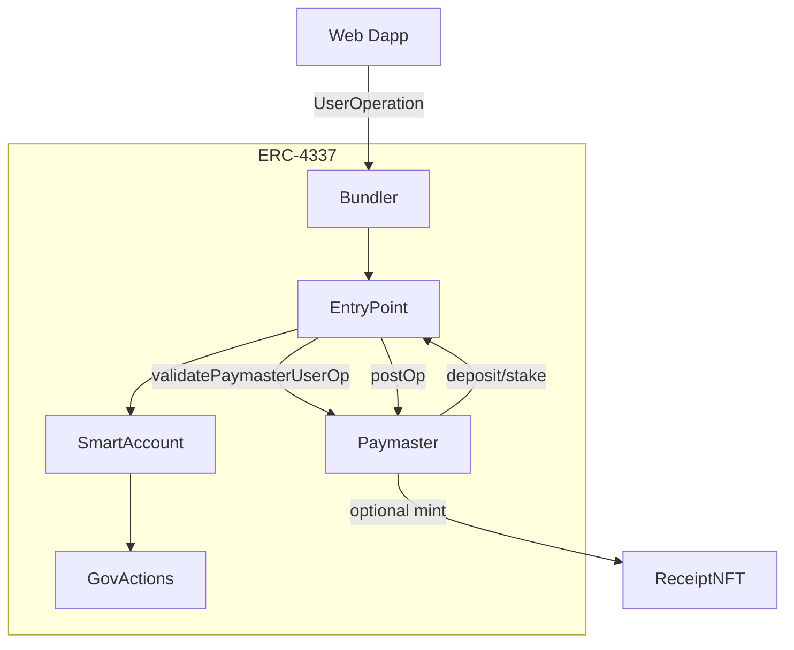

# DAO Gas Reimbursement Paymaster (ERC‑4337)

Portfolio‑ready demo of a DAO gas reimbursement system using ERC‑4337 Account Abstraction. A verifying paymaster sponsors gas for allowlisted smart accounts within per‑month budgets, enforces per‑operation safety caps, supports a global monthly cap, and can mint a non‑transferable receipt NFT for each sponsored operation. The repo contains the on‑chain contracts, Foundry tests and scripts, a polished Next.js demo dapp, and CI.

## Purpose
- Demonstrate a realistic AA paymaster with clear safety rails and admin workflows.
- Provide a deployable web URL showcasing the UX, budgets, and a sample governance target.
- Serve as reference code for recruiters and contributors evaluating AA knowledge.

## Current Status
- Contracts compile on solc 0.8.28 and tests are in place.
- Demo web app deployed (Next.js 15, Turbopack) with professional dark theme.
- AA send is preview‑only; bundler submission is scaffolded for future work.

## Architecture


### 4337 handleOps sequence (high-level)
```mermaid
sequenceDiagram
  participant UI
  participant Bundler
  participant EntryPoint
  participant Paymaster
  participant Account as SmartAccount
  participant Target as GovActions

  UI->>Bundler: sendUserOperation(UserOp)
  Bundler->>EntryPoint: handleOps(batch)
  EntryPoint->>Account: validateUserOp
  EntryPoint->>Paymaster: validatePaymasterUserOp
  Note right of Paymaster: check budget, caps, allowlist
  EntryPoint->>Account: execute callData
  Account->>Target: business call (setParam/grantRole)
  EntryPoint->>Paymaster: postOp(actualGasCost)
  Note right of Paymaster: debit budget; optional mint ReceiptNFT
  EntryPoint->>Bundler: settle; refund remainder
```

## Contracts
- `contracts/BudgetPaymaster.sol`: Paymaster with per‑sender monthly budgets, per‑op caps (gas/fee/wei), optional global monthly cap, inline UTC month epoch math, pause, stake/deposit/withdraw helpers, and ReceiptNFT integration.
- `contracts/ReceiptNFT.sol`: ERC‑721 SBT (ERC‑5192 semantics) minted per sponsored operation.
- `contracts/GovActions.sol`: Demo target contract emitting events.

### Key features
- Per‑sender monthly budgets with lazy epoch rollover (UTC months).
- Per‑operation caps: verification/call/postOp gas, absolute max fee gwei, basefee multiplier, max wei per op.
- Optional global monthly cap across all users.
- Sender allowlist via “budget > 0”. Optional factory allowlist for `initCode`.
- Auto‑deposit ETH to EntryPoint on `receive()`; admin stake/unstake/withdraw.
- Optional `ReceiptNFT` mint on successful sponsorship (soulbound semantics).

## Local Demo (no bundler)
Simulate validate+postOp locally (shows budgeting and events):
```
make demo
```
Outputs include budget updates and “Demo done” log. This uses a mock EntryPoint and does not broadcast a real UserOperation.

## Full AA Demo (optional)
Use a bundler URL:
- Hosted: Etherspot Skandha, Pimlico, Stackup, ZeroDev → create a project and copy the HTTPS bundler URL.
- Local: run a bundler docker (Skandha/Stackup), point NEXT_PUBLIC_BUNDLER_RPC_URL to http://localhost:PORT.

## Tech stack
- On‑chain: Solidity 0.8.28, OpenZeppelin Contracts, ERC‑4337 interfaces, Foundry (forge/cast)
- Tests: Foundry unit + integration, fuzzing hooks ready, gas snapshots/coverage in CI
- Web: Next.js 15 (App Router, Turbopack), TypeScript, wagmi v2, viem v2, minimal Zustand‑free state, CSS custom properties (dark DeFi theme)
- CI/CD: GitHub Actions (build, test, lint), Vercel deploy for web
- Lint/Sec: solhint config, Slither step in CI (optional; requires environment tooling)

## Prereqs
- Foundry (forge) installed and on PATH.
- Testnet RPC and funded ADMIN Safe/account (for testnet mode).

## Env
Copy `.env.example` to `.env` and set for your target chain:
```
ENTRYPOINT_ADDRESS_SEPOLIA=...
SIMPLE_ACCOUNT_FACTORY_SEPOLIA=...
ADMIN_SEPOLIA=0x692fcdA9cf88724fb37Aef28dAc2E965DB1200bF
TREASURY_SEPOLIA=0x692fcdA9cf88724fb37Aef28dAc2E965DB1200bF

ENTRYPOINT_ADDRESS_BASE_SEPOLIA=...
SIMPLE_ACCOUNT_FACTORY_BASE_SEPOLIA=...
ADMIN_BASE_SEPOLIA=0x8d12A103d91cFa13c7381f4Af0b6953b1E7ae293
TREASURY_BASE_SEPOLIA=0x8d12A103d91cFa13c7381f4Af0b6953b1E7ae293

BUNDLER_RPC_SEPOLIA=...
BUNDLER_RPC_BASE_SEPOLIA=...
```

For scripts, export generic names before running (example for Sepolia):
```
$Env:ENTRYPOINT_ADDRESS=$Env:ENTRYPOINT_ADDRESS_SEPOLIA
$Env:SIMPLE_ACCOUNT_FACTORY=$Env:SIMPLE_ACCOUNT_FACTORY_SEPOLIA
$Env:ADMIN_ADDRESS=$Env:ADMIN_SEPOLIA
$Env:TREASURY_ADDRESS=$Env:TREASURY_SEPOLIA
```

## Build & Test
```
forge build
forge test
```

## Deploy
Broadcast with your admin key:
```
forge script script/Deploy.s.sol:Deploy \
  --rpc-url <RPC> \
  --broadcast \
  --private-key <ADMIN_PK> \
  -vvvv
```
Env required: `ENTRYPOINT_ADDRESS`, `ADMIN_ADDRESS`, `TREASURY_ADDRESS`, `SIMPLE_ACCOUNT_FACTORY`.

Outputs:
- GovActions address
- BudgetPaymaster address

## Stake & Deposit
Add stake and deposit to EntryPoint via the paymaster:
```
$Env:PAYMASTER_ADDRESS=<pm address>
$Env:UNSTAKE_DELAY_SEC=604800   # 7 days
$Env:STAKE_AMOUNT_WEI=10000000000000000    # 0.01 ETH
$Env:DEPOSIT_AMOUNT_WEI=10000000000000000  # 0.01 ETH

forge script script/StakeAndDeposit.s.sol:StakeAndDeposit \
  --rpc-url <RPC> \
  --broadcast \
  --private-key <ADMIN_PK> \
  -vvvv
```

## Seed a Budget
```
$Env:PAYMASTER_ADDRESS=<pm address>
$Env:BUDGET_ACCOUNT=<smart account>
$Env:BUDGET_LIMIT_WEI=50000000000000000   # 0.05 ETH
$Env:ADMIN_ADDRESS=<admin address>

forge script script/SeedBudget.s.sol:SeedBudget \
  --rpc-url <RPC> \
  --broadcast \
  --private-key <ADMIN_PK> \
  -vvvv
```

## Admin Ops: Caps and Global Cap
Set per-op caps and fee rules:
```
$Env:PAYMASTER_ADDRESS=<pm>
$Env:ADMIN_ADDRESS=<admin>
$Env:MAX_VERIFICATION_GAS=120000
$Env:MAX_CALL_GAS=1000000
$Env:MAX_POSTOP_GAS=120000
$Env:ABSOLUTE_MAX_FEE_GWEI=150
$Env:BASEFEE_MULTIPLIER=3
$Env:MAX_WEI_PER_OP=10000000000000000  # 0.01 ETH

forge script script/SetCaps.s.sol:SetCaps --rpc-url <RPC> --broadcast --private-key <ADMIN_PK> -vvvv
```

Enable or adjust global monthly cap (0 disables):
```
$Env:PAYMASTER_ADDRESS=<pm>
$Env:ADMIN_ADDRESS=<admin>
$Env:GLOBAL_LIMIT_WEI=500000000000000000  # 0.5 ETH

forge script script/SetGlobalCap.s.sol:SetGlobalCap --rpc-url <RPC> --broadcast --private-key <ADMIN_PK> -vvvv
```

## Receipts (optional)
Deploy ReceiptNFT and link it to the paymaster (mint on sponsorship):
```
$Env:ADMIN_ADDRESS=<admin>
$Env:PAYMASTER_ADDRESS=<pm>
forge script script/DeployReceipt.s.sol:DeployReceipt --rpc-url <RPC> --broadcast --private-key <ADMIN_PK> -vvvv
```

## Web Dapp
- Landing page shows: wallet connect, Demo Mode badge, budget KPIs, budget reader, GovActions demo calls, and an AA UserOperation preview builder. Sections are cardized with a DeFi dark theme and responsive layout.
- Logo: place a `logo.jpg` in repo root (auto‑copied to `web/public/` in this repo).
- Env (`web/.env`):
```
NEXT_PUBLIC_RPC_URL=
NEXT_PUBLIC_CHAIN_ID=11155111
NEXT_PUBLIC_ENTRYPOINT_ADDRESS=
NEXT_PUBLIC_PAYMASTER_ADDRESS=
NEXT_PUBLIC_GOV_ACTIONS_ADDRESS=
NEXT_PUBLIC_BUNDLER_RPC_URL=
NEXT_PUBLIC_SIMPLE_ACCOUNT_FACTORY=
```

## AA Integration (M2)
The web app includes an AA toggle and client scaffolding (`web/src/lib/aa.ts`). M2 will implement full UserOperation packing/signing and bundler submission with `paymasterAndData` supplied by this paymaster, plus a send flow with toasts and receipt linking.

## Limitations & future work
- Sender-based allowlist (no target parsing) for MVP; can add per-target checks for SimpleAccount.
- AA send is preview-only in UI; full bundler integration to follow.
- Global cap is simplistic; consider role-based workflows and rate limiting.
- No upgradability; replace-and-migrate if logic changes.

## Deploying the web (Vercel)
- Set Project Root Directory to `web`.
- Default build command `npm run build` and output `.next` are fine.
- If module resolution errors occur, avoid tsconfig path aliases in imports or ensure `tsconfig` paths are aligned with Turbopack.
